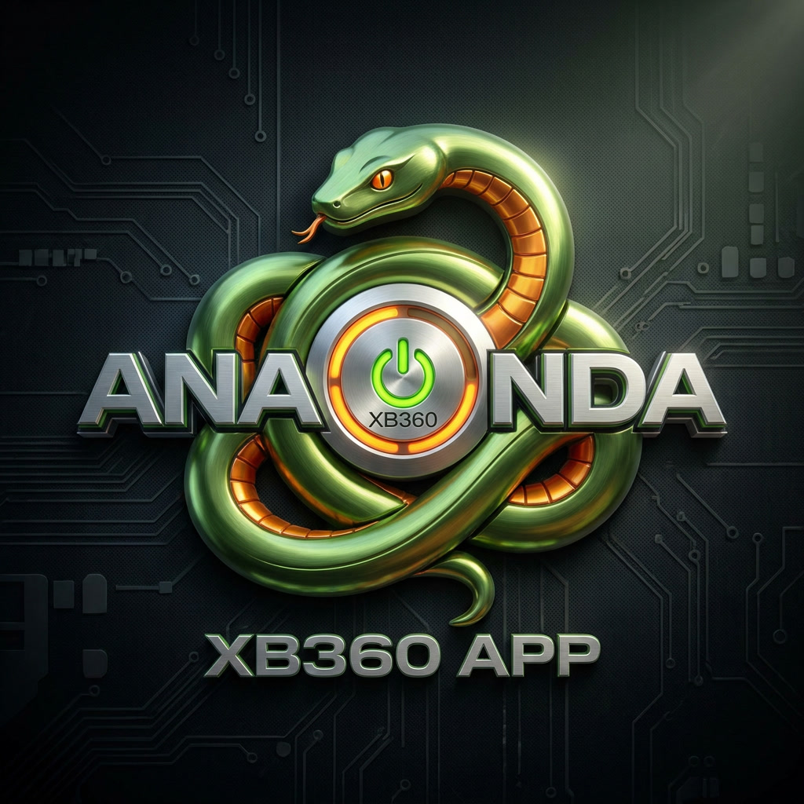

**A custom homebrew store for modded Xbox 360 consoles.**

Browse, download, and install homebrew apps, games, emulators, and themes
directly on-console via Aurora. Pulls from Anaconda's own catalog plus the
Free60 Store (951261/X-Store).

[Report a Bug](https://github.com/H3X-Anaconda-Team/anaconda-xb-360/issues) ·
[Request a Feature](https://github.com/H3X-Anaconda-Team/anaconda-xb-360/issues) ·
[Website](https://h3x-anaconda-team.github.io/Anaconda-XB-360-website/)

---

## Status

> **Not public yet. Early development. Solo project.**
>
> Anaconda XB 360 is built and maintained by **one person**, with no team,
> no funding, and no outside help. Progress is slow by necessity — updates
> will come when they come. Please be patient, and thank you for your
> interest in the project.

---

### ⭐ Star this repo for release dates and updates ⭐

Watch the repo or star it to be notified the moment a build goes public.

## Connect

*More socials coming soon.*

---

## Compatibility

Anaconda XB 360 works on **any modded Xbox 360** that meets the following:

| Requirement | Details |
|---|---|
| **Console type** | RGH, JTAG, or softmod |
| **Dashboard** | Aurora must be installed |
| **Storage** | HDD or USB drive for installs |
| **Network** | Internet access for downloading content |

If your console can run Aurora, it can run Anaconda XB 360.

---

## What It Does

- **Browse categories** — apps, games, emulators, themes, and more
- **Download directly on-console** — no PC required to install content
- **Auto-extract and place** files in the correct folders
- **Pulls from multiple sources** — Anaconda's catalog plus the Free60 Store
- **Configurable repo URL** — change the source from the Settings menu

---

## Repository Layout

| Folder | Purpose |
|---|---|
| `script/` | The Anaconda XB 360 store client (Aurora Lua) |
| `repo/` | The `.ini` catalog the client downloads and reads |

---

### Anaconda XB 360

*Custom boot screen and branding — designed for modded consoles.*

---

## Screenshots & Demos

*More screenshots and UI previews will be added once the project reaches
its first public build. The boot screen GIF at the top of this page is
an early preview.*

---

## Release Info

Anaconda XB 360 is **not available for download yet**.

- ⭐ **Star this repo** to be notified when a release drops
- 👁 **Watch** the repo to get all activity in your feed
- 🐛 **Open an issue** if you want to report something or suggest a feature

Release dates and update notes will be posted here and in the
[Releases](https://github.com/H3X-Anaconda-Team/anaconda-xb-360/releases) tab.

---

## Contributing

This is a solo project, so contributions aren't open right now. If you find
a bug or want to suggest something, open an issue — it will be read, but
responses may be slow.

---

## License

[MIT](LICENSE) © 2026 H3X Anaconda Team

Not affiliated with Microsoft, Aurora, or any other project referenced here.

---

